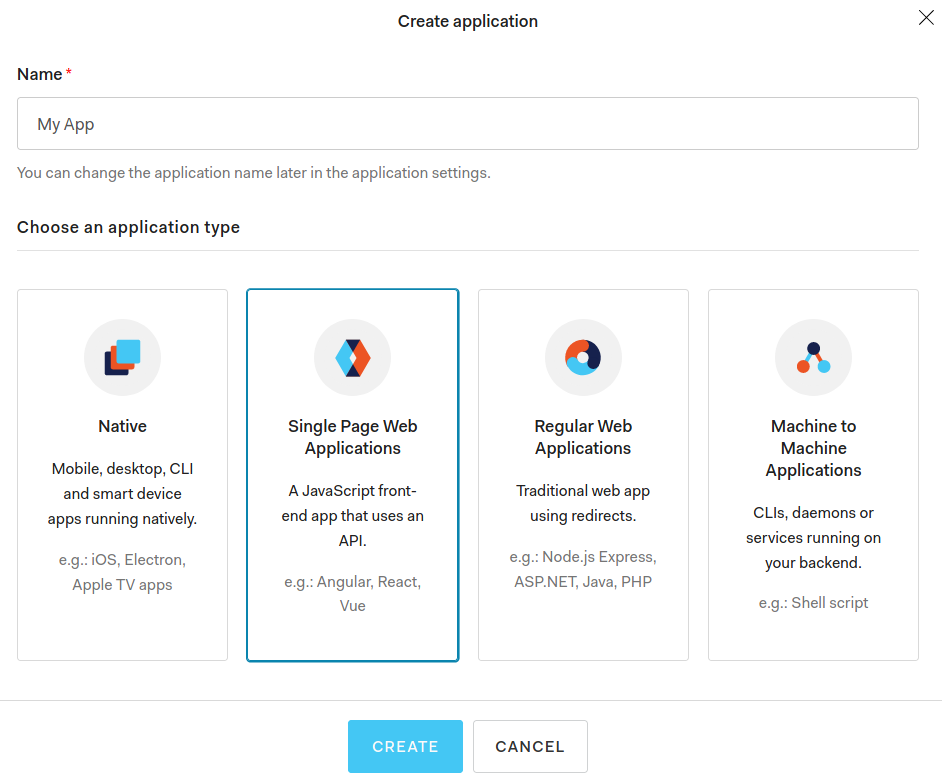

# Auth0 Configuration

## Info

[Auth0](https://auth0.com/) is one of identity providers that can be choose to manage users in Schema CMS.

## Set Up
1. [Create](https://auth0.com/signup) a new account or log-in to existing one.
2. Create new tenant that will be used by Schema CMS or use default one:

    
    
3. Create required applications:
    
    3.1. Go to `Applications`.
    
    
    
    3.2. Create `Single Page Application`, you can choose the name you want.
    
    
    
    3.3. In application settings you will find values that you need set later in `local.env` file
    if you want run application locally or in `ssm_parametes.json` if you want to deploy app to AWS.

    - set `Client ID` as `DJANGO_SOCIAL_AUTH_AUTH0_KEY`
    
    - set `Client Secret` as `DJANGO_SOCIAL_AUTH_AUTH0_SECRET`
    
    - set `Domain` as `DJANGO_SOCIAL_AUTH_AUTH0_DOMAIN`
    
    
    
    3.4. Fill required fields replacing `example.com` with domain name you will use. For local use `example.com` should be replaced by `localhost:8000`.
    
     - `Allowed Callback URLs`:
        - `http://example.com/api/v1/auth/complete/auth0`
        
     - `Allowed Logout URLs`:
        - `http://example.com/api/v1/auth/login/auth0,`
        - `http://example.com/auth/not-registered,`
        - `http://example.com/auth/revoked-access`
        
     - `Allowed Web Origins`:
        - `http://example.com`
            
    
    
    3.5 Go back to `Appliactions` tab and create `Machine to Machine` application, you can choose name you want.
    
    
    
    3.6. Select `Auth0 Management API` and select `All` scopes.
    
    
    
    3.7. Use `Client ID`, `Client Secret` and `Domian`, to set later correct values in `local.env` or `ssm_parametes.json`.
    
    - set `Client ID` as `DJANGO_USER_MGMT_AUTH0_KEY`
    
    - set `Client Secret` as `DJANGO_USER_MGMT_AUTH0_SECRET`
    
    - set `Domain` as `DJANGO_USER_MGMT_AUTH0_DOMAIN`
    
    3.8. Fill required fields replacing `example.com` with domain name you will use. For local use `example.com` should be replaced by `localhost:8000`.
    - `Allowed Callback URLs`:
        - `http://example.com`
        
    - `Allowed Web Origins`:
        - `http://example.com`
        
    
    
    
