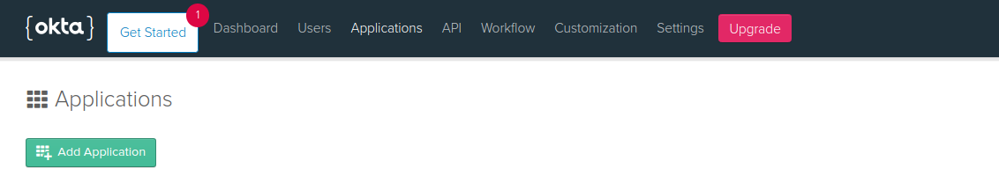
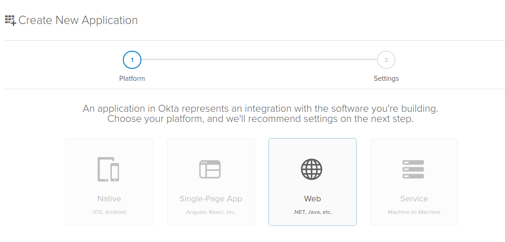
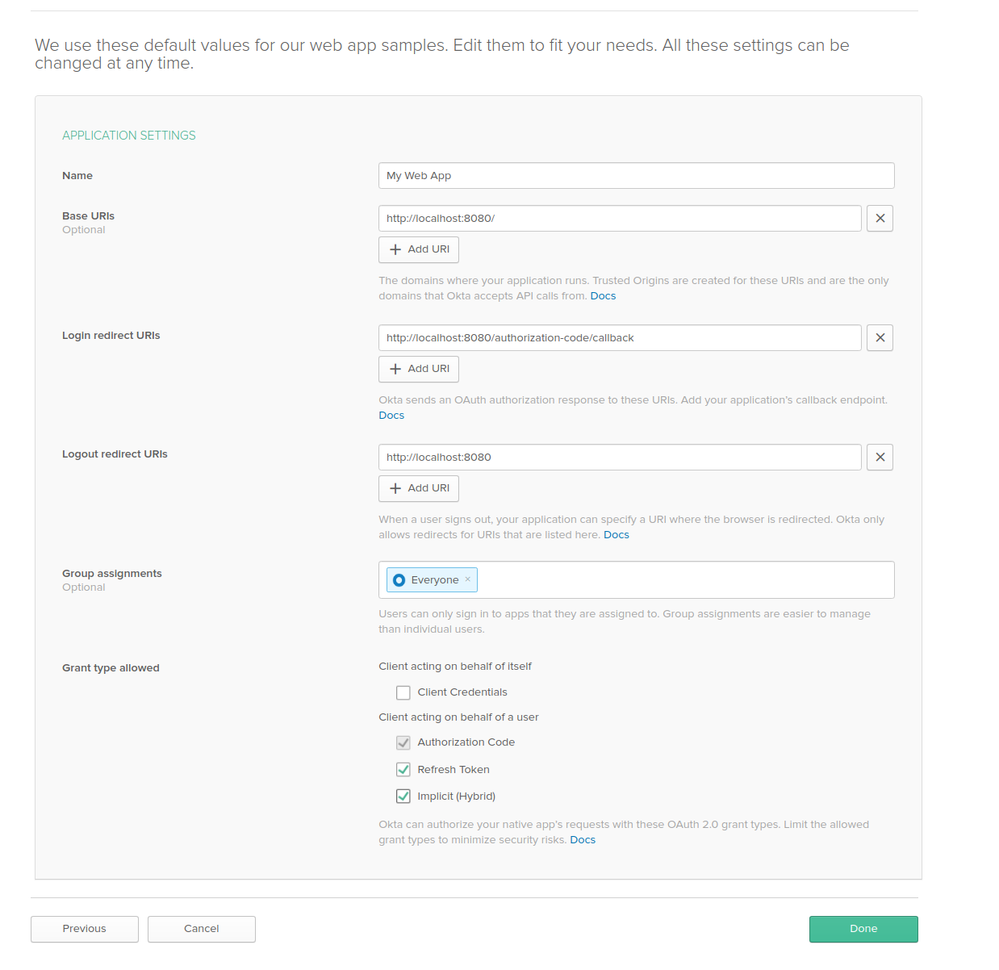
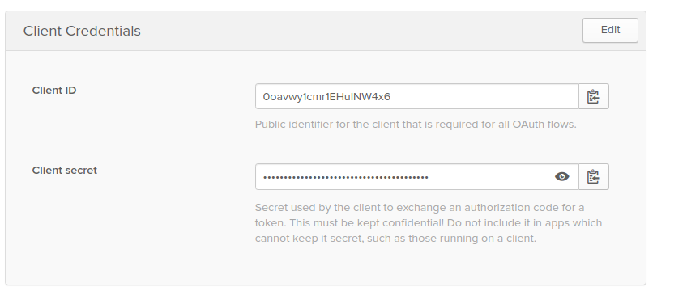
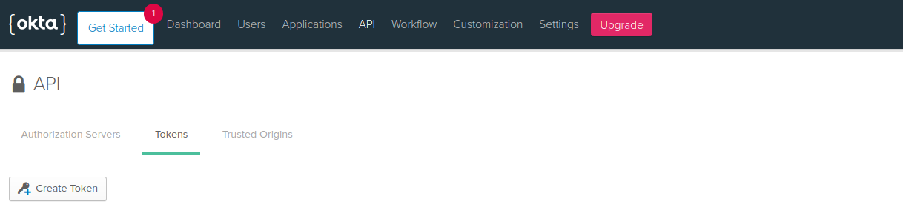
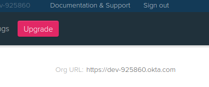

# Auth0 Configuration

## Info

[Okta](https://okta.com/) is one of identity providers that can be choose to manage users in Schema CMS.

## Set Up
1. [Log-in](https://login.okta.com/) to existing Okta account or create new one. Notice that base Okta version is not free but you can use
[developer](https://developer.okta.com/signup/) version to create new account in test purposes. 
2. Create required application:
    
    3.1. Go to `Applications` and click `Add Appliaction`.
    
    
    
    3.2. Create `Web` application.
    
    
    
    3.3. Fill required fields replacing `example.com` with domain name you will use. For local use `example.com` should be replaced by `localhost:8000`.
     - `Name`:
        - You can choose the name you want
        
     - `Base URIs `:
        - `http://example.com`
        
     - `Login redirect URIs`:
        - `http://example.com/api/v1/auth/complete/okta-oauth2`
        
     - `Logout redirect URIs`:
        - `http://example.com/api/v1/auth/login/okta-oauth2,`
        - `http://example.com/auth/not-registered,`
        - `http://example.com/auth/revoked-access`
        
     - `Allowed Web Origins`:
        - `http://example.com`
            
     - `Grant type allowed`:
        - Tick `Refresh Token` and `Implicit (Hybrid)`
        
    
    
    3.4. After app is created you will find values at the bottom of the page that you need set later in `local.env` file
    if you want run application locally or in `ssm_parametes.json` if you want to deploy app to AWS.

    - set `Client ID` as `SOCIAL_AUTH_OKTA_OAUTH2_KEY`
    
    - set `Client Secret` as `SOCIAL_AUTH_OKTA_OAUTH2_SECRET`
    
    
    
    3.5 Now you need generate api token to you Okta instance so go to `API` tab and choose `Token`.
    
    - click `Create Token`
    - enter name for your token
    - copy token and use it later as value for `OKTA_API_TOKEN` in `local.env` or `ssm_parametes.json`
    
    
    
    3.6. Last value you need is `OKTA_DOMAIN_URL`, you can find it when you go to `Dashboard` tab .
    
    
