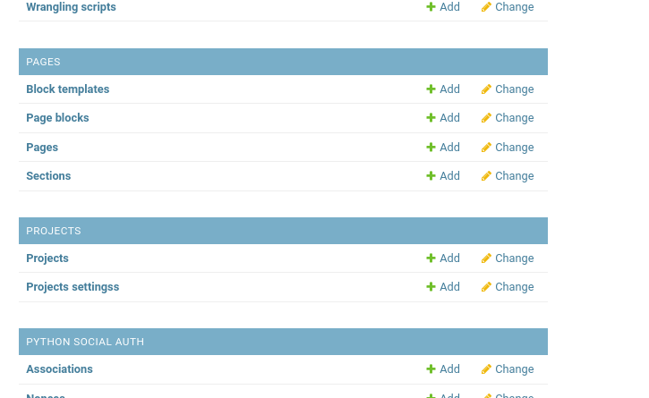
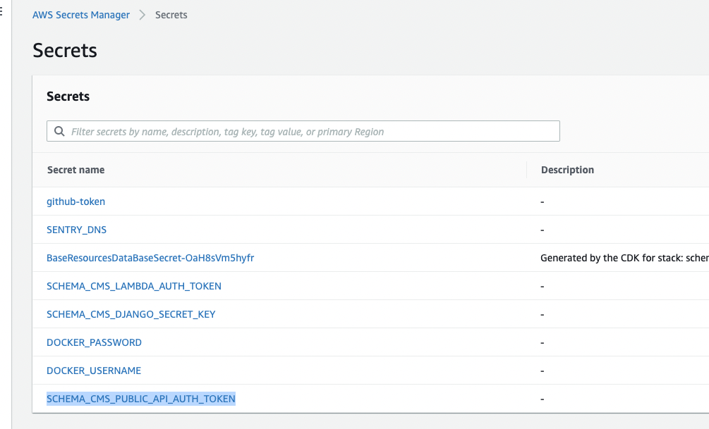

# Token Overview

1. Tokenization works only on the latest SchemaCMS version - >= 1.12.2
2. There is a new model `ProjectsSettings` added in the admin panel where we can set `protect_public_api` value. As default value is set to `False`.
   
3. If the admin wants the api to be protected go to Projects settings -> click Add projects settings in top right corner - > check `protect_public_api` box and `Save`.
      
4. `PROTECT_PUBLIC_API` can be updated via 
5. The token is generated automatically even then `protect_public_api` is set to `False` and can be found in `AWS Secret Manager` - > `SCHEMA_CMS_PUBLIC_API_AUTH_TOKEN`
   
6. To access public-api that is protected developer need to add `Authorization` header to request with value `Token <token from secret manager>`
